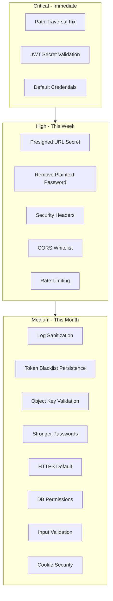

# Security Pentest Audit and Remediation Plan

## Executive Summary

Security audit of the Object Storage Console has identified **16 vulnerabilities** across critical, high, and medium severity levels. This plan outlines findings and fixes.

---

## CRITICAL VULNERABILITIES

### 1. Path Traversal Vulnerability (CVE-class: CWE-22)

**Location:** [`src/storage/PathManager.cpp`](src/storage/PathManager.cpp) lines 217-223

**Issue:** The `sanitize_key()` function does NOTHING - returns input unchanged:

```cpp
String PathManager::sanitize_key(const String& key) const {
    String sanitized = key;
    return sanitized;  // NO SANITIZATION!
}
```

**Attack Vector:** An attacker can use `../../../etc/passwd` as object key to read/write arbitrary files.

**Fix:** Implement proper path traversal protection:

- Block `..` sequences
- Normalize paths and verify they remain within storage root
- Reject null bytes and path separators in keys

---

### 2. Hardcoded Default JWT Secret

**Location:** [`config.json`](config.json) line 21

```json
"jwt_secret": "your-secret-key-change-this-in-production"
```

**Issue:** Default secret is publicly known. If not changed, all JWTs can be forged.

**Fix:**

- Generate cryptographically random secret on first run
- Add startup validation that rejects default/weak secrets
- Add warning logs if using default secret

---

### 3. Default Admin Credentials

**Location:** [`config.json`](config.json) lines 28-32

```json
"default_admin": {
    "username": "admin",
    "password": "changeme"
}
```

**Issue:** Predictable admin credentials allow immediate system compromise.

**Fix:**

- Force password change on first login
- Add startup check for default credentials with warnings
- Generate random initial password and display once

---

## HIGH SEVERITY VULNERABILITIES

### 4. Fallback to Hardcoded Presigned URL Secret

**Location:** [`src/clients/LocalStorageClient.cpp`](src/clients/LocalStorageClient.cpp) lines 879-881

```cpp
if (secret_key.empty()) {
    secret_key = "object-storage-presigned-default-secret-v1";
}
```

**Issue:** Hardcoded fallback secret allows presigned URL forgery.

**Fix:** Fail explicitly if no secret is configured instead of using fallback.

---

### 5. Plain Text Password Comparison Fallback

**Location:** [`src/utils/PasswordHash.cpp`](src/utils/PasswordHash.cpp) lines 54-57

```cpp
if (!is_hashed(hash)) {
    CONSOLE_LOG_WARN("Comparing against unhashed password - this is insecure!");
    return password == hash;  // PLAIN TEXT COMPARISON!
}
```

**Issue:** Legacy plaintext password comparison bypasses PBKDF2 security.

**Fix:** Remove plaintext comparison fallback entirely.

---

### 6. Missing Security Headers

**Location:** [`src/filters/CorsFilter.cpp`](src/filters/CorsFilter.cpp), [`src/main.cpp`](src/main.cpp)

**Missing headers:**

- `X-Frame-Options: DENY`
- `X-Content-Type-Options: nosniff`
- `X-XSS-Protection: 1; mode=block`
- `Content-Security-Policy`
- `Strict-Transport-Security` (when SSL enabled)

**Fix:** Add security headers middleware.

---

### 7. Overly Permissive CORS

**Location:** [`src/filters/CorsFilter.cpp`](src/filters/CorsFilter.cpp) line 21

```cpp
resp->addHeader("Access-Control-Allow-Origin", origin);  // Reflects any origin!
```

**Issue:** Any origin is accepted, enabling CSRF attacks from malicious sites.

**Fix:** Whitelist allowed origins from configuration.

---

### 8. No Rate Limiting

**Issue:** No rate limiting on authentication endpoints allows brute-force attacks.

**Fix:** Implement rate limiting for:

- `/api/v1/auth/login` - limit to 5 attempts/minute
- All API endpoints - general throttling

---

## MEDIUM SEVERITY VULNERABILITIES

### 9. Sensitive Data in Logs

**Location:** [`src/services/AuthService.cpp`](src/services/AuthService.cpp) line 33

```cpp
CONSOLE_LOG_INFO("Login attempt for user: {}", username);
```

**Issue:** Login attempts logged with usernames (potential PII).

**Fix:** Use obfuscated identifiers or reduce log verbosity for auth events.

---

### 10. JWT Token in Memory Blacklist

**Location:** [`src/services/AuthService.cpp`](src/services/AuthService.cpp) lines 60-62

```cpp
std::lock_guard<std::mutex> lock(blacklist_mutex_);
token_blacklist_.insert(token);
```

**Issue:** In-memory blacklist is lost on restart, allowing revoked tokens to work.

**Fix:** Persist blacklist to database.

---

### 11. Insufficient Object Key Validation

**Location:** [`src/clients/LocalStorageClient.cpp`](src/clients/LocalStorageClient.cpp) line 495

**Issue:** Object keys not validated for dangerous characters (null bytes, control chars).

**Fix:** Add comprehensive object key validation.

---

### 12. Secret Key Minimum Length Too Short

**Location:** [`src/services/UserService.cpp`](src/services/UserService.cpp) line 313

```cpp
if (secret_key.length() < 8) {
```

**Issue:** 8 characters is too short for secrets.

**Fix:** Increase minimum to 16 characters.

---

### 13. No HTTPS Enforcement

**Location:** [`config.json`](config.json) line 6

```json
"enable_ssl": false
```

**Issue:** SSL disabled by default, credentials sent in plaintext.

**Fix:** Enable SSL by default, add HSTS header when enabled.

---

### 14. Database File World-Readable

**Location:** [`config.json`](config.json) line 35

```json
"path": "console.db"
```

**Issue:** SQLite database may have world-readable permissions containing hashed passwords.

**Fix:** Set restrictive file permissions (0600) on database creation.

---

### 15. Missing Input Validation on API Endpoints

**Multiple locations** - JSON payloads not consistently validated for:

- Maximum field lengths
- Character encoding
- Nested depth limits

**Fix:** Add JSON schema validation middleware.

---

### 16. Session Cookie Settings

**Location:** [`src/main.cpp`](src/main.cpp) line 100

```cpp
app().enableSession(3600);
```

**Issue:** Session cookies may lack `Secure`, `HttpOnly`, `SameSite` flags.

**Fix:** Configure secure cookie settings.

---

## Implementation Priority



---

## Files to Modify

| File | Changes |

|------|---------|

| `src/storage/PathManager.cpp` | Implement `sanitize_key()` properly |

| `src/main.cpp` | Add security headers, cookie settings, startup validation |

| `src/utils/PasswordHash.cpp` | Remove plaintext fallback |

| `src/clients/LocalStorageClient.cpp` | Remove hardcoded secrets, add key validation |

| `src/filters/CorsFilter.cpp` | Implement origin whitelist |

| `src/services/AuthService.cpp` | Persist token blacklist |

| `src/services/UserService.cpp` | Increase password requirements |

| `config.json` | Change defaults, add security options |
