# МИНИСТЕРСТВО НАУКИ И ВЫСШЕГО ОБРАЗОВАНИЯ РОССИЙСКОЙ ФЕДЕРАЦИИ

## ФЕДЕРАЛЬНОЕ ГОСУДАРСТВЕННОЕ АВТОНОМНОЕ ОБРАЗОВАТЕЛЬНОЕ УЧРЕЖДЕНИЕ ВЫСШЕГО ОБРАЗОВАНИЯ

## «Национальный исследовательский ядерный университет «МИФИ»

### ИНСТИТУТ ИНТЕЛЛЕКТУАЛЬНЫХ КИБЕРНЕТИЧЕСКИХ СИСТЕМ

### КАФЕДРА «КОМПЬЮТЕРНЫЕ СИСТЕМЫ И ТЕХНОЛОГИИ» (№12)

---

# КУРСОВАЯ РАБОТА

по дисциплине

**МЕТОДЫ И СРЕДСТВА ВЕДЕНИЯ НАУЧНО-ИССЛЕДОВАТЕЛЬСКОЙ РАБОТЫ**

**Тема:** Разработка веб-консоли управления объектным хранилищем данных

| | |
|---|---|
| **Студент** | Кротов Е.Г. |
| **Группа** | С21-501 |
| **Руководитель** | Бушина Ксения Сергеевна, НИЯУ МИФИ, старший преподаватель кафедры №12 |

---

**Москва, 2025**

---

# СОДЕРЖАНИЕ

1. Постановка задачи
2. Моделирование верхнего уровня процесса с помощью BPMN
   - 2.1 Назначение диаграммы BPMN
   - 2.2 Основные элементы диаграммы и их назначение
   - 2.3 Диаграммы BPMN для процесса «Жизненный цикл объекта в хранилище»
3. Моделирование динамических аспектов при помощи диаграмм
   - 3.1 Назначение диаграммы Activity
   - 3.2 Основные элементы диаграммы и их назначение
   - 3.3 Диаграммы деятельности для процесса
     - 3.3.1 Диаграммы деятельности AS-IS
     - 3.3.2 Диаграммы деятельности TO-BE
   - 3.4 Назначение диаграммы Use-Case
   - 3.5 Основные элементы диаграммы и их назначение
   - 3.6 Диаграмма сценариев выполнения функций
   - 3.7 Назначение диаграммы Statechart
   - 3.8 Основные элементы диаграммы и их назначение
   - 3.9 Диаграмма состояния
   - 3.10 Назначение диаграммы Sequence
   - 3.11 Основные элементы диаграммы и их назначение
   - 3.12 Диаграмма последовательности
4. Моделирование статических аспектов при помощи диаграмм
   - 4.1 Назначение диаграммы трассировки требований
   - 4.2 Основные элементы диаграммы и их назначение
   - 4.3 Диаграмма трассировки требований
   - 4.4 Назначение диаграммы Class Diagram
   - 4.5 Основные элементы диаграммы и их назначение
   - 4.6 Диаграмма классов

---

# 1 ПОСТАНОВКА ЗАДАЧИ

В ходе выполнения курсовой работы по дисциплине «Методы и средства ведения научно-исследовательской работы» необходимо выполнить моделирование динамических и статических аспектов системы с использованием нотации UML.

В рамках курсовой работы был выбран процесс «Жизненный цикл объекта в хранилище», разработанный в рамках темы НИР «Разработка веб-консоли управления объектным хранилищем данных».

**Описание системы:**

Веб-консоль управления объектным хранилищем данных (Object Storage) представляет собой систему для управления данными в распределённом хранилище, совместимом с S3 API. Система предоставляет пользователям возможность загружать, скачивать, удалять объекты, а также управлять бакетами (контейнерами) для организации данных.

Процесс «Жизненный цикл объекта в хранилище» можно разделить на три основных этапа:

1. **Загрузка объекта.** Пользователь отправляет запрос на загрузку файла, указывая целевой бакет и ключ объекта. Система выполняет аутентификацию пользователя по JWT-токену, проверяет права доступа на основе политик, опционально шифрует данные и сохраняет объект в хранилище с метаданными.

2. **Чтение объекта.** Пользователь запрашивает ранее загруженный объект по ключу. Система проверяет права доступа, извлекает объект из хранилища, выполняет расшифровку (если требуется) и возвращает данные пользователю.

3. **Удаление объекта.** Пользователь запрашивает удаление объекта. Система проверяет политики retention (защиты от удаления), и если удаление разрешено, помечает объект на удаление или выполняет физическое удаление.

**Инструменты моделирования:**

- Для моделирования верхнего уровня процесса используется диаграмма BPMN (Business Process Model and Notation).
- Для моделирования динамических аспектов используются: диаграмма деятельности (Activity Diagram), диаграмма сценариев выполнения функций (Use-case Diagram), диаграмма состояний (Statechart Diagram) и диаграмма последовательностей (Sequence Diagram).
- Для моделирования статических аспектов используются: диаграмма трассировки требований и диаграмма классов (Class Diagram).

---

# 2 МОДЕЛИРОВАНИЕ ВЕРХНЕГО УРОВНЯ ПРОЦЕССА С ПОМОЩЬЮ BPMN

## 2.1 Назначение диаграммы BPMN

BPMN (Business Process Model and Notation) — это язык моделирования бизнес-процессов, который является промежуточным звеном между формализацией/визуализацией и воплощением бизнес-процесса. Нотация представляет собой описание графических элементов, используемых для построения схемы протекания бизнес-процесса.

Цель применения BPMN — смоделировать бизнес-процесс, выявить способы адаптации под новые условия, а также пути повышения эффективности и конкурентоспособности. На данный момент широко используется вторая версия данной нотации — BPMN 2.0.

## 2.2 Основные элементы диаграммы и их назначение

Основные элементы, из которых состоит BPMN-диаграмма:

- **События** — используются для отображения какого-то происшествия. События могут быть стартовыми, завершающими или промежуточными. Стартовые обозначают начало процесса, завершающие — его окончание, а промежуточные события могут приостанавливать выполнение процесса.

- **Действия (задачи)** — используются для отображения функций, которые будут выполняться системой. Обычное действие используется для описания активности, которую нельзя разбить. Подпроцесс используется, когда необходимо в описываемый процесс внедрить ещё один как его часть.

- **Шлюзы** — элементы, которые используются для введения в процесс развилок, различных условий или дополнительной логики:
  - «Исключающее ИЛИ» — разделение выполнения процесса на один из вариантов;
  - «И» — распараллеливание процесса на две ветки;
  - «Включающее ИЛИ» — сочетание функций обоих типов.

- **Потоки** — стрелка, которая отображает последовательность действий в процессе.

- **Дорожки** — подписанный прямоугольник, внутри которого укладываются элементы, выполняемые определённым участником или системой.

## 2.3 Диаграммы BPMN для процесса «Жизненный цикл объекта в хранилище»

### Диаграмма BPMN AS-IS

Диаграмма BPMN для AS-IS процесса «Жизненный цикл объекта в хранилище» отображает текущее состояние процесса работы с файлами на традиционном файловом сервере с использованием NTFS и Active Directory.

**Основные шаги процесса AS-IS:**

1. Пользователь открывает проводник Windows
2. Вводит сетевой путь к файловому серверу (\\\\server\\share)
3. Система проверяет права доступа NTFS
4. При отсутствии доступа — ручной запрос к IT-администратору
5. IT-администратор настраивает права в Active Directory
6. Пользователь копирует файл на сервер

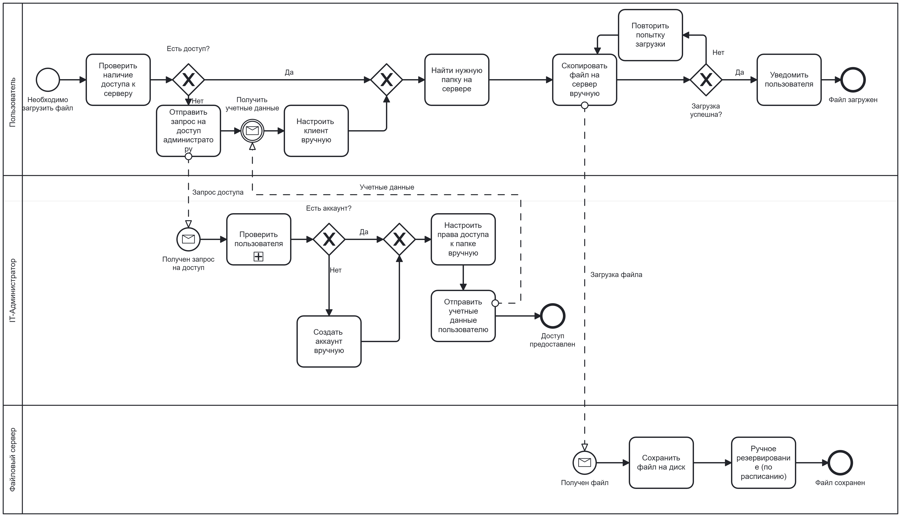

*Рисунок 2.1 — Диаграмма BPMN AS-IS*

### Диаграмма BPMN TO-BE

Диаграмма BPMN для TO-BE процесса показывает целевое состояние с использованием разработанной веб-консоли Object Storage.

**Основные шаги процесса TO-BE:**

1. Пользователь входит в веб-консоль
2. Система автоматически проверяет JWT-токен
3. Пользователь выбирает бакет и загружает файл через REST API
4. Система проверяет политики доступа автоматически
5. Данные опционально шифруются (AES-256-GCM)
6. Объект сохраняется в распределённое хранилище

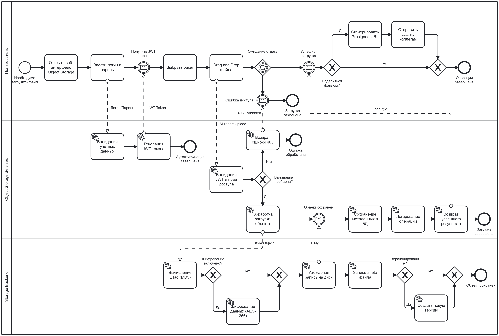

*Рисунок 2.2 — Диаграмма BPMN TO-BE*

---

# 3 МОДЕЛИРОВАНИЕ ДИНАМИЧЕСКИХ АСПЕКТОВ ПРИ ПОМОЩИ ДИАГРАММ

## 3.1 Назначение диаграммы Activity

Диаграмма деятельности показывает поток переходов от одной деятельности к другой. Основным элементом является состояние деятельности или просто деятельность. Деятельность представляет собой некоторое состояние, в котором что-либо выполняется: будь то процесс реального времени, либо исполнение компьютерной программы.

Диаграмма деятельности описывает последовательность подобных деятельностей, позволяя при этом одновременно изображать как условное, так и параллельное поведение.

## 3.2 Основные элементы диаграммы и их назначение

Диаграмма деятельности в общем случае состоит из:

- **Состояний деятельности и состояний действия** — выполняемые атомарные вычисления. Состояния действия не могут быть подвергнуты декомпозиции и атомарны. Состояния деятельности могут быть подвергнуты дальнейшей декомпозиции.

- **Переходов** — когда действие или деятельность в некотором состоянии завершается, поток управления переходит в следующее состояние. Переход представляется простой линией со стрелкой.

- **Объектов** — в потоке управления могут участвовать объекты, которые порождаются или модифицируются различными видами деятельности.

- **Решений (ромбы)** — точки ветвления потока управления на основе условий.

- **Начального и конечного узлов** — обозначают начало и завершение процесса.

## 3.3 Диаграммы деятельности для процесса «Жизненный цикл объекта в хранилище»

Для каждого шага в верхнеуровневых диаграммах BPMN были построены диаграммы деятельности с использованием вертикальных колонок (swimlanes):

- **Входные и выходные объекты** — данные, участвующие в процессе
- **Шаги процессов** — действия и решения
- **Участники** — акторы, выполняющие действия

### 3.3.1 Диаграммы деятельности AS-IS

Данные диаграммы AS-IS (как есть) показывают шаги процесса без использования веб-консоли Object Storage, с использованием традиционного файлового сервера.

#### Диаграмма деятельности AS-IS для шага «1. Загрузка файла на файловый сервер»

**Входные объекты:**
- Исходный файл
- Сетевой путь (\\\\server\\share)
- Права NTFS

**Шаги процесса:**
1. Открыть проводник Windows
2. Ввести сетевой путь к серверу
3. Проверить права NTFS
4. [Решение: Доступ есть?]
   - Нет → Запросить доступ у IT-администратора → Ожидать (часы/дни) → Настроить права в AD → Повторить проверку
   - Да → Найти папку на сервере
5. Перетащить файл в папку
6. [Решение: Загрузка успешна?]
   - Нет → Повторить попытку
   - Да → Записать файл на диск
7. Обновить файловый индекс

**Выходные объекты:**
- Файл на сервере

**Участники:**
- Пользователь
- IT-Администратор

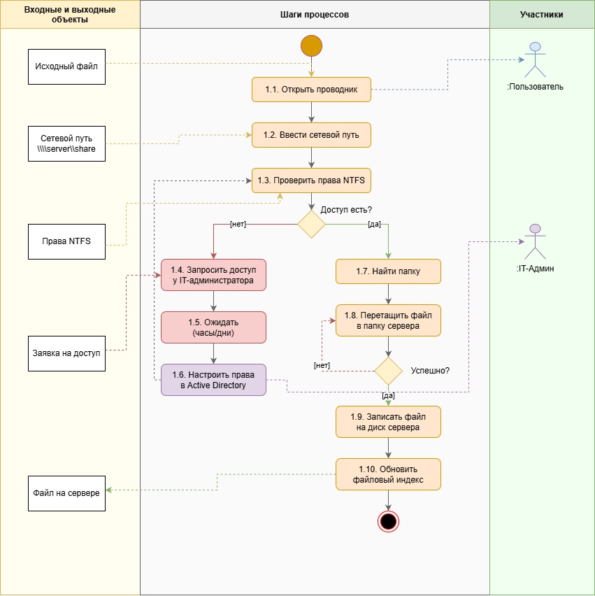

*Рисунок 3.1 — Диаграмма деятельности AS-IS «Загрузка файла»*

#### Диаграмма деятельности AS-IS для шага «2. Запрос доступа к файловому серверу»

**Входные объекты:**
- Ошибка доступа
- Заявка (email/телефон)
- Время ожидания (4-24 часа)

**Шаги процесса:**
1. Обнаружить отсутствие доступа к папке
2. Составить заявку по email/телефону
3. Отправить заявку в IT-отдел
4. Ожидать обработки (4-24 часа)
5. Получить заявку (IT-администратор)
6. Проверить полномочия пользователя
7. [Решение: Одобрено?]
   - Нет → Отклонить заявку, уведомить → Конец
   - Да → Открыть Active Directory
8. Найти пользователя, добавить в группу безопасности
9. Обновить ACL на файловом сервере

**Выходные объекты:**
- Права доступа [предоставлены]

**Участники:**
- Пользователь
- IT-Администратор

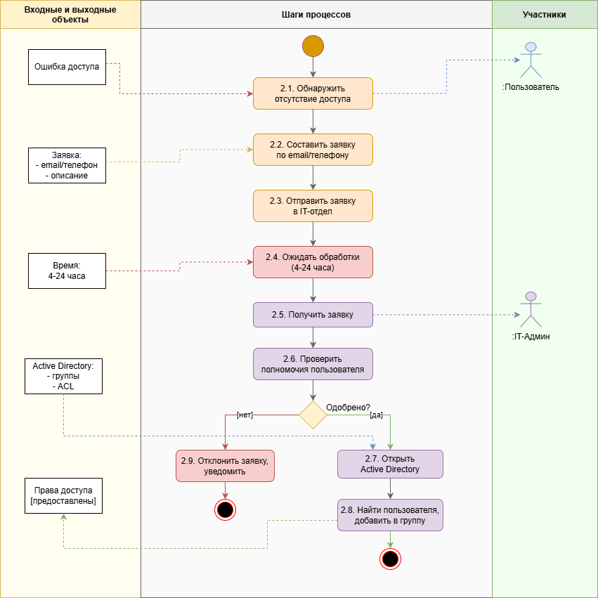

*Рисунок 3.2 — Диаграмма деятельности AS-IS «Запрос доступа»*

### 3.3.2 Диаграммы деятельности TO-BE

Данные диаграммы TO-BE (как должно быть) показывают шаги процесса с использованием разработанной веб-консоли Object Storage.

#### Диаграмма деятельности TO-BE для шага «1. Загрузка объекта»

**Входные объекты:**
- UploadRequest (bucket, key, data)
- JWT Token
- Policy (effect, actions)
- EncryptedData (cipher, iv)

**Шаги процесса:**
1. Отправить запрос на загрузку (REST API)
2. Валидировать JWT токен
3. [Решение: Валиден?]
   - Нет → Вернуть ошибку (401) → Конец
   - Да → Продолжить
4. Проверить права по политикам
5. [Решение: Есть права?]
   - Нет → Вернуть ошибку (403) → Конец
   - Да → Продолжить
6. [Решение: Шифрование включено?]
   - Да → Зашифровать данные (AES-256-GCM)
   - Нет → Пропустить шифрование
7. Сохранить объект в хранилище
8. Сохранить метаданные
9. Вернуть успешный ответ

**Выходные объекты:**
- Object (key, etag, size)

**Участники:**
- Пользователь
- Система

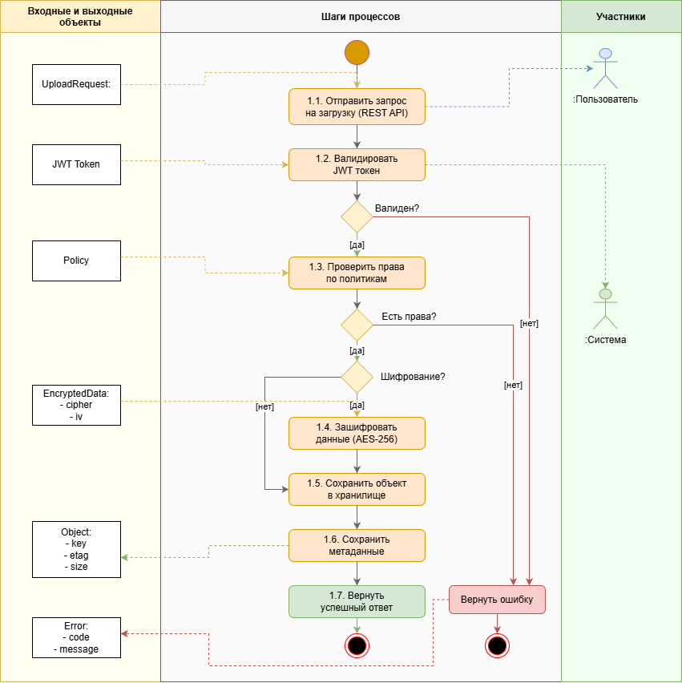

*Рисунок 3.3 — Диаграмма деятельности TO-BE «Загрузка объекта»*

#### Диаграмма деятельности TO-BE для шага «2. Аутентификация»

**Входные объекты:**
- Credentials (access_key, secret_key)
- User (id, policies[], is_admin)

**Шаги процесса:**
1. Отправить credentials (REST API)
2. Найти пользователя по access_key
3. [Решение: Найден?]
   - Нет → Вернуть ошибку (401 Unauthorized) → Конец
   - Да → Продолжить
4. Проверить secret_key (hash)
5. [Решение: Совпадает?]
   - Нет → Вернуть ошибку (401) → Конец
   - Да → Продолжить
6. Сгенерировать JWT токен
7. Создать сессию
8. Вернуть токен и данные пользователя

**Выходные объекты:**
- JWT Token (user_id, exp, iat)
- Session (token, expires_at)

**Участники:**
- Пользователь
- Система

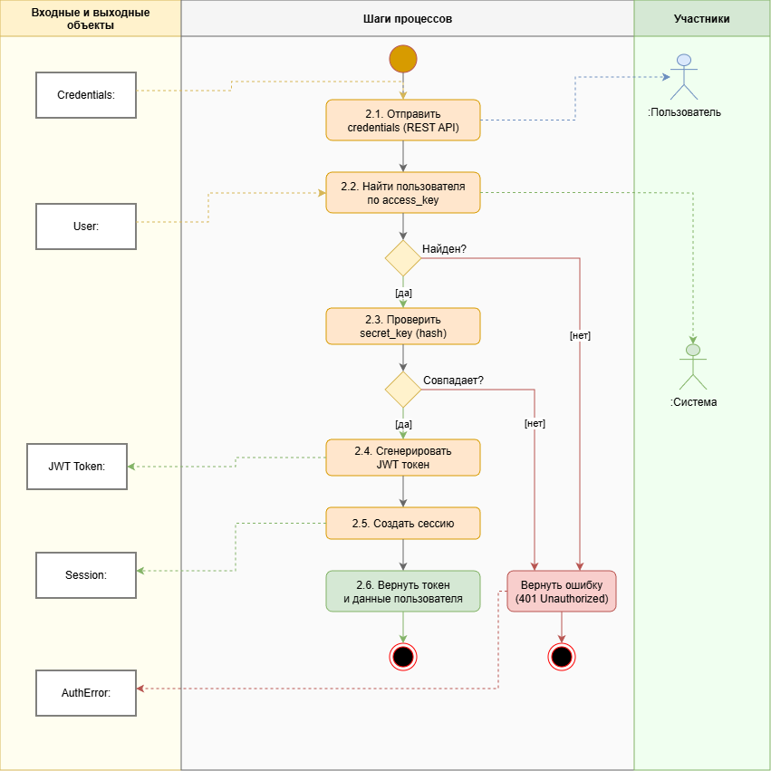

*Рисунок 3.4 — Диаграмма деятельности TO-BE «Аутентификация»*

---

## 3.4 Назначение диаграммы Use-Case

Диаграмма вариантов использования (сценариев поведения, прецедентов) является исходным концептуальным представлением системы в процессе её проектирования и разработки.

Суть данной диаграммы состоит в следующем: проектируемая система представляется в виде множества актёров, взаимодействующих с системой с помощью так называемых вариантов использования. Актёром называется любой объект, субъект или система, взаимодействующая с моделируемой системой извне. Вариант использования — это спецификация сервисов (функций), которые система предоставляет актёру.

Use-case диаграммы применяют для моделирования статического вида системы с точки зрения сценариев использования.

## 3.5 Основные элементы диаграммы и их назначение

Диаграмма состоит из:

- **Актёры** — внешние сущности, взаимодействующие с системой (пользователи, внешние системы, планировщики).

- **Варианты использования (Use Cases)** — функции, которые система предоставляет актёрам. Отображаются в виде эллипсов.

- **Отношения:**
  - **Ассоциация** — связь между актёром и вариантом использования
  - **Включение (<<include>>)** — обязательное включение одного варианта использования в другой
  - **Расширение (<<extend>>)** — опциональное расширение функциональности
  - **Обобщение** — наследование между актёрами или вариантами использования

- **Граница системы** — прямоугольник, ограничивающий функциональность системы

## 3.6 Диаграмма сценариев выполнения функций

Диаграмма сценариев выполнения функций для системы Object Storage включает следующих актёров и варианты использования:

### Актёры:

1. **Пользователь** — основной пользователь системы
2. **Администратор** — наследует права Пользователя, имеет расширенные полномочия
3. **Внешняя система (API)** — интеграция через REST API
4. **Планировщик** — автоматические задачи по расписанию

### Варианты использования:

**Аутентификация (UC-01..03):**
- UC-01: Войти в систему
- UC-02: Выйти из системы
- UC-03: Обновить токен

**Работа с объектами (UC-10..17):**
- UC-10: Загрузить объект
- UC-11: Скачать объект
- UC-12: Удалить объект
- UC-13: Просмотреть список объектов
- UC-14: Получить информацию об объекте
- UC-15: Копировать объект
- UC-16: Сгенерировать presigned URL
- UC-17: Изменить метаданные

**Работа с бакетами (UC-20..24):**
- UC-20: Создать бакет
- UC-21: Удалить бакет
- UC-22: Просмотреть список бакетов
- UC-23: Получить информацию о бакете
- UC-24: Настроить политику бакета

**Администрирование (UC-30..36):**
- UC-30: Управлять пользователями
- UC-31: Управлять политиками
- UC-32: Просматривать аудит логи
- UC-33: Настроить retention
- UC-34: Настроить шифрование
- UC-35: Настроить версионирование
- UC-36: Настроить lifecycle rules

**Автоматические задачи (UC-40..42):**
- UC-40: Очистить устаревшие объекты
- UC-41: Архивировать объекты
- UC-42: Проверить retention

### Отношения:

- Все операции с объектами и бакетами **<<include>>** «Проверить авторизацию»
- UC-10 «Загрузить объект» **<<include>>** «Валидировать данные»
- «Зашифровать данные» **<<extend>>** UC-10 «Загрузить объект»
- «Записать в аудит лог» **<<extend>>** операции с объектами
- Актёр «Администратор» наследует (generalization) актёра «Пользователь»

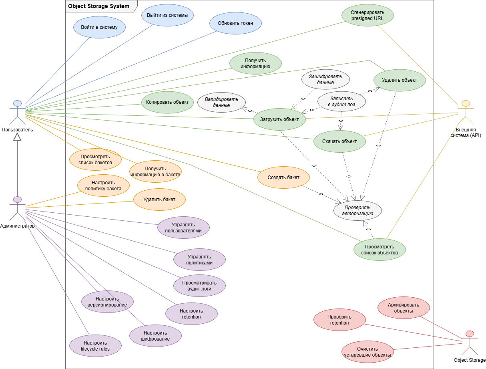

*Рисунок 3.5 — Диаграмма сценариев выполнения функций*

---

## 3.7 Назначение диаграммы Statechart

Диаграмма состояний описывает последовательность состояний, через которые проходит объект на протяжении своего жизненного цикла, реагируя на события.

Данный вид диаграмм реализует представление конечного автомата. Описывает динамическое поведение объектов, отражая их жизненный цикл. Каждый объект является изолированной сущностью, а взаимодействие с внешним миром происходит путём реагирования объекта на события.

Событиями могут быть:
- Получение вызова
- Передача сигнала
- Изменение определённых значений
- Истечение заданного промежутка времени

## 3.8 Основные элементы диаграммы и их назначение

Диаграмма состоит из:

- **Состояния** — прямоугольники со скруглёнными углами, представляющие различные состояния объекта
- **Начальное состояние** — заполненный кружок
- **Конечное состояние** — кружок с точкой внутри
- **Переходы** — стрелки между состояниями, подписанные событиями/действиями
- **Подсостояния** — вложенные состояния внутри составного состояния

## 3.9 Диаграмма состояния

Диаграмма состояний для жизненного цикла объекта в системе Object Storage:

### Состояния объекта:

1. **Uploading (Загрузка)** — объект загружается в систему
2. **Active (Активный)** — объект доступен для операций
3. **Versioned (Версионирован)** — создана новая версия объекта
4. **Locked (Заблокирован)** — объект защищён от удаления (retention)
5. **Encrypted (Зашифрован)** — данные объекта зашифрованы
6. **Marked (Помечен на удаление)** — объект помечен для удаления
7. **Archived (В архиве)** — объект перенесён в архивное хранилище

### Переходы:

- `upload()`: Начало → Uploading
- `complete()`: Uploading → Active
- `version()`: Active → Versioned
- `restore()`: Versioned → Active
- `encrypt()`: Active → Encrypted
- `decrypt()`: Encrypted → Active
- `lock()`: Active → Locked
- `unlock()`: Locked → Active
- `delete()`: Active → Marked
- `restore()`: Marked → Active
- `purge()`: Marked → Конец
- `archive()`: Active → Archived
- `unarchive()`: Archived → Active

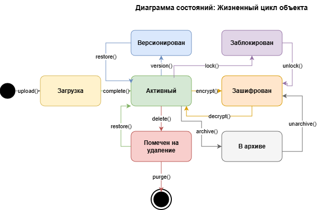

*Рисунок 3.6 — Диаграмма состояний объекта*

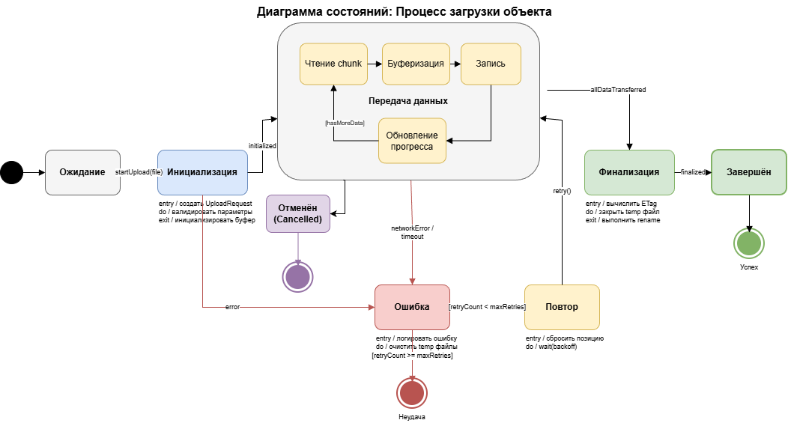

*Рисунок 3.6а — Диаграмма состояний процесса загрузки*

---

## 3.10 Назначение диаграммы Sequence

Диаграммы взаимодействия используются для описания сценариев взаимодействия объектов. Диаграмма последовательностей (Sequence diagram) используется, когда основное внимание уделяется временному упорядочиванию сообщений.

На диаграмме объекты располагаются слева направо: объект, инициирующий взаимодействие, располагается левее. По вертикальной оси размещаются сообщения — более поздние ниже.

## 3.11 Основные элементы диаграммы и их назначение

- **Объекты (участники)** — прямоугольники в верхней части диаграммы
- **Линия жизни** — вертикальная пунктирная линия от объекта вниз
- **Фокус управления** — вытянутый прямоугольник на линии жизни, показывающий время активности объекта
- **Сообщения** — горизонтальные стрелки между линиями жизни:
  - Синхронный вызов — сплошная стрелка с заполненным наконечником
  - Асинхронный вызов — сплошная стрелка с открытым наконечником
  - Ответ — пунктирная стрелка

## 3.12 Диаграмма последовательности

Диаграмма последовательности для процесса «Загрузка объекта в хранилище»:

### Участники:

1. **Client** — клиентское приложение
2. **API Gateway** — точка входа в систему
3. **AuthService** — сервис аутентификации
4. **PolicyEvaluator** — сервис проверки политик
5. **ObjectService** — сервис управления объектами
6. **EncryptionService** — сервис шифрования
7. **StorageClient** — клиент хранилища
8. **MetadataManager** — менеджер метаданных

### Последовательность сообщений:

```
Client -> API Gateway: PUT /buckets/{bucket}/objects/{key}
API Gateway -> AuthService: validateToken(token)
AuthService --> API Gateway: UserInfo
API Gateway -> PolicyEvaluator: checkAccess(user, bucket, "s3:PutObject")
PolicyEvaluator --> API Gateway: AccessGranted
API Gateway -> ObjectService: uploadObject(bucket, key, data)
ObjectService -> EncryptionService: encrypt(data)
EncryptionService --> ObjectService: encryptedData
ObjectService -> StorageClient: store(bucket, key, encryptedData)
StorageClient --> ObjectService: storageResult
ObjectService -> MetadataManager: saveMetadata(object)
MetadataManager --> ObjectService: metadataSaved
ObjectService --> API Gateway: ObjectInfo
API Gateway --> Client: 200 OK + ObjectInfo
```

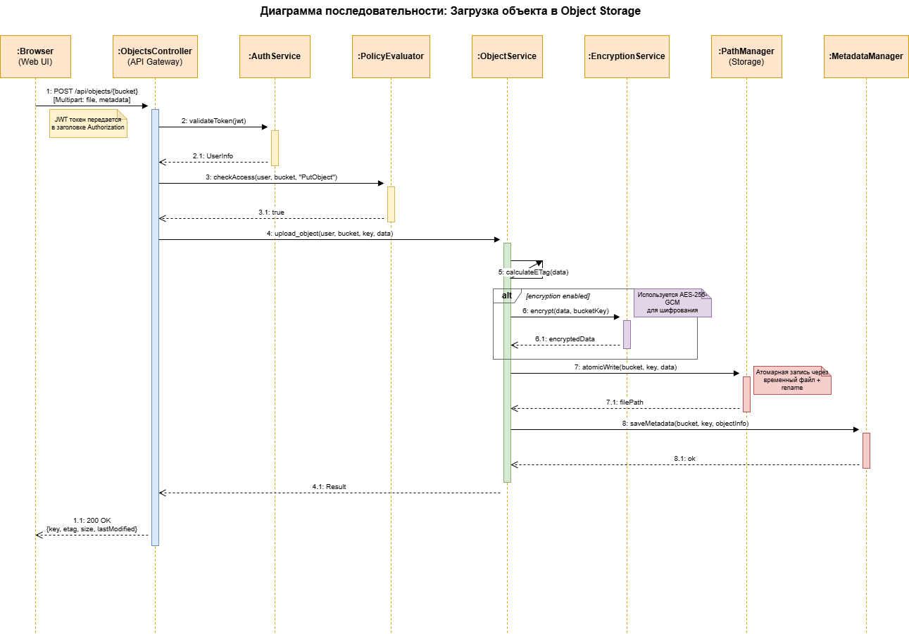

*Рисунок 3.7 — Диаграмма последовательности*

---

# 4 МОДЕЛИРОВАНИЕ СТАТИЧЕСКИХ АСПЕКТОВ ПРИ ПОМОЩИ ДИАГРАММ

## 4.1 Назначение диаграммы трассировки требований

Диаграмма трассировки требований позволяет:

- Понять источник требований
- Обозначить область проекта
- Работать с изменениями требований
- Оценить воздействие изменений в требованиях на проект
- Оценить воздействие сбоя теста на требования
- Убедиться, что реализация системы отвечает всем требованиям
- Убедиться, что приложение делает только то, что от него требуется

Диаграмма трассировки требований помогает понять, как входные требования преобразуются в спецификации и реализуются в функциональной системе.

## 4.2 Основные элементы диаграммы и их назначение

Элементы диаграммы трассировки требований:

- **Шаги процесса** — основные этапы выполнения функций системы
- **Требования (Description)** — формализованное описание того, что должна делать система
- **Функции** — конкретные функции, реализующие требования

Диаграмма организована в три вертикальные колонки, показывающие связь между шагами процесса, требованиями и функциями.

## 4.3 Диаграмма трассировки требований

### Шаги процесса и связанные требования:

**1.1. Аутентификация пользователя**
- **Требование:** В системе д.б. реализована возможность аутентификации пользователя по access_key и secret_key с выдачей JWT токена
- **Функции:**
  - Проверить credentials
  - Сгенерировать JWT
  - Валидировать токен

**1.2. Проверка прав доступа**
- **Требование:** В системе д.б. реализована возможность проверки прав пользователя на основе политик доступа (policies) для бакетов и объектов
- **Функции:**
  - Получить политики
  - Оценить разрешения

**1.3. Управление бакетами**
- **Требование:** В системе д.б. реализованы операции CRUD для бакетов: создание, удаление, получение списка, получение информации
- **Функции:**
  - Создать бакет
  - Удалить бакет
  - Получить список бакетов

**1.4. Загрузка объектов**
- **Требование:** В системе д.б. реализована возможность загрузки объектов в бакет с проверкой прав и опциональным шифрованием данных
- **Функции:**
  - Валидировать данные
  - Зашифровать данные
  - Сохранить объект

**1.5. Скачивание объектов**
- **Требование:** В системе д.б. реализована возможность скачивания объектов из бакета с автоматической расшифровкой
- **Функции:**
  - Получить объект
  - Расшифровать данные
  - Передать клиенту

**1.6. Удаление объектов**
- **Требование:** В системе д.б. реализована возможность удаления объектов с проверкой retention политик
- **Функции:**
  - Проверить retention
  - Удалить объект

**2.1. Генерация presigned URL**
- **Требование:** В системе д.б. реализована возможность генерации временных ссылок для доступа к объектам
- **Функции:**
  - Сформировать URL
  - Подписать URL

**3.1. Шифрование данных**
- **Требование:** В системе д.б. реализовано шифрование данных по алгоритму AES-256-GCM с производной ключа PBKDF2
- **Функции:**
  - Сгенерировать ключ
  - Зашифровать AES-256

**3.2. Управление метаданными**
- **Требование:** В системе д.б. реализовано хранение и управление метаданными объектов (content-type, size, etag)
- **Функции:**
  - Сохранить метаданные
  - Вычислить ETag

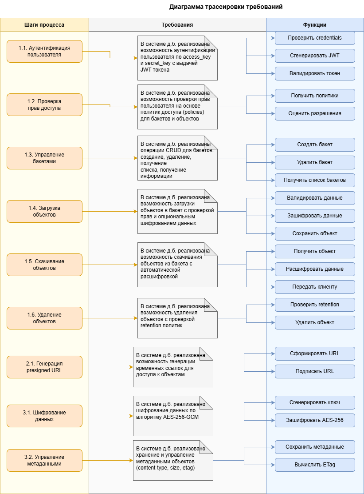

*Рисунок 4.1 — Диаграмма трассировки требований*

---

## 4.4 Назначение диаграммы Class Diagram

Диаграммы классов используются при моделировании систем наиболее часто. Они являются одной из форм статического описания системы с точки зрения её проектирования, показывая её структуру. Диаграмма классов не отображает динамическое поведение объектов.

## 4.5 Основные элементы диаграммы и их назначение

На диаграммах классов показываются классы, интерфейсы и отношения между ними.

**Класс** — основной строительный блок программных систем. Каждый класс имеет:
- **Название** — в верхней секции
- **Атрибуты** — именованные свойства класса (средняя секция)
- **Операции** — услуги, предоставляемые объектами класса (нижняя секция)

**Отношения:**

- **Ассоциация** — связь между объектами, может иметь кратность (1, *, 0..1)
- **Обобщение** — связь класс-родитель и класс-потомок (наследование)
- **Зависимость** — отношение использования (изменение одного элемента влияет на другой)
- **Агрегация** — отношение «часть-целое» (часть может существовать отдельно)
- **Композиция** — строгое отношение «часть-целое» (часть не может существовать без целого)
- **Реализация** — класс реализует интерфейс

## 4.6 Диаграмма классов

### Пакет: console::models

**Класс Object:**
- Атрибуты:
  - info_: ObjectInfo
  - key_: String
  - bucket_: String
  - size_: int64_t
  - last_modified_: TimePoint
  - etag_: String
  - content_type_: String
  - encrypted_: bool
  - encryption_algorithm_: String
- Операции:
  - to_json(): Json::Value
  - from_json(json): Object
  - extension(): String
  - is_directory(): bool

**Класс Bucket:**
- Атрибуты:
  - info_: BucketInfo
  - name_: String
  - region_: String
  - creation_date_: TimePoint
  - size_bytes_: int64_t
  - object_count_: int64_t
  - versioning_enabled_: bool
  - encryption_enabled_: bool
- Операции:
  - to_json(): Json::Value
  - from_json(json): Bucket

**Класс User:**
- Атрибуты:
  - info_: UserInfo
  - access_key_: String
  - secret_key_: String
  - account_name_: String
  - policies_: Vector<String>
  - is_admin_: bool
  - created_at_: TimePoint
- Операции:
  - to_json(): Json::Value
  - from_json(json): User
  - add_policy(policy): void

**Класс Policy:**
- Атрибуты:
  - name_: String
  - version_: String
  - statements_: Vector<Statement>
  - effect_: Effect (Allow/Deny)
  - actions_: Vector<String>
  - resources_: Vector<String>
- Операции:
  - to_json(): Json::Value
  - from_json(json): Policy

**Класс ObjectRetention:**
- Атрибуты:
  - mode_: Mode (Governance/Compliance)
  - retain_until_date_: TimePoint
- Операции:
  - to_json(): Json::Value

### Пакет: console::services

**Интерфейс IObjectService:**
- Операции:
  - list_objects(user, bucket, prefix): Result<Vector<Object>>
  - get_object_info(user, bucket, key): Result<Object>
  - download_object(user, bucket, key): Result<ByteArray>
  - upload_object(user, bucket, key, data): Result<Object>
  - delete_object(user, bucket, key): Result<void>
  - copy_object(user, src, dest): Result<Object>
  - set_object_metadata(user, bucket, key, meta): Result
  - generate_presigned_url(user, bucket, key): Result<String>

**Интерфейс IBucketService:**
- Операции:
  - list_buckets(user): Result<Vector<Bucket>>
  - create_bucket(user, name, region): Result<Bucket>
  - delete_bucket(user, name): Result<void>
  - get_bucket_info(user, name): Result<Bucket>
  - set_bucket_policy(user, name, policy): Result
  - set_bucket_versioning(user, name, enabled): Result
  - set_bucket_encryption(user, name, config): Result
  - get_bucket_lifecycle(user, name): Result<Json>

**Класс ObjectService (реализует IObjectService):**
- Атрибуты:
  - storage_client_: IStorageClient*
  - encryption_service_: EncryptionService*
  - policy_evaluator_: PolicyEvaluator*
  - metadata_manager_: MetadataManager*

**Класс BucketService (реализует IBucketService):**
- Атрибуты:
  - storage_client_: IStorageClient*
  - path_manager_: PathManager*
  - lifecycle_service_: LifecycleService*

**Класс AuthService:**
- Атрибуты:
  - jwt_: JWT*
  - password_hash_: PasswordHash*
  - token_blacklist_: TokenBlacklist*
  - user_service_: IUserService*
- Операции:
  - login(access_key, secret_key): Result<Token>
  - validate_token(token): Result<UserInfo>
  - logout(token): void

**Класс EncryptionService:**
- Атрибуты:
  - algorithm_: String (AES-256-GCM)
  - key_derivation_: String (PBKDF2)
- Операции:
  - encrypt(data, key): ByteArray
  - decrypt(data, key): ByteArray
  - generate_key(): String

**Класс PolicyEvaluator:**
- Операции:
  - evaluate(user, action, resource): bool
  - check_bucket_access(user, bucket, action): bool
  - check_object_access(user, bucket, key, action): bool

### Отношения:

- ObjectService **реализует** IObjectService (пунктирная стрелка)
- BucketService **реализует** IBucketService (пунктирная стрелка)
- ObjectService **использует** EncryptionService, PolicyEvaluator (зависимость)
- User **агрегирует** Policy (1..*)
- Object **агрегирует** ObjectRetention (0..1)
- Bucket **композиция** Object (*)

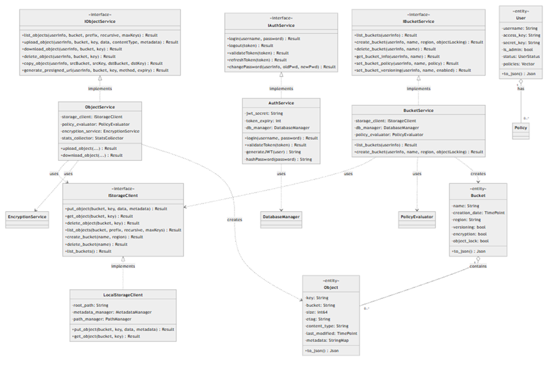

*Рисунок 4.2 — Диаграмма классов*

---

# СПИСОК ИСПОЛЬЗОВАННЫХ ИСТОЧНИКОВ

1. OMG Unified Modeling Language (UML) Specification, Version 2.5.1, 2017.
2. BPMN 2.0 Specification, Object Management Group, 2011.
3. Фаулер М. UML. Основы. — СПб.: Символ-Плюс, 2004.
4. Буч Г., Рамбо Дж., Якобсон А. Язык UML. Руководство пользователя. — М.: ДМК Пресс, 2006.
5. Amazon S3 API Reference, Amazon Web Services, 2024.
6. MinIO Object Storage Documentation, 2024.

---

# ПРИЛОЖЕНИЕ А — Список файлов диаграмм

| Тип диаграммы | Исходный файл | Изображение |
|---------------|---------------|-------------|
| BPMN AS-IS | - | BPMN_as-is-file-management.png |
| BPMN TO-BE | - | BPMN_to-be-object-storage.png |
| Activity AS-IS 1 | activity-asis-01-file-upload.drawio | AS_IS_1.drawio.png |
| Activity AS-IS 2 | activity-asis-02-access-request.drawio | AS_IS_2.drawio.png |
| Activity TO-BE 1 | activity-tobe-01-object-upload.drawio | TO_BE_1.drawio.png |
| Activity TO-BE 2 | activity-tobe-02-authentication.drawio | TO_BE_2.drawio.png |
| Use Case | usecase-object-storage.drawio | UC.drawio.png |
| Statechart 1 | state-object-lifecycle.drawio | STATE_1.drawio.png |
| Statechart 2 | state-upload-process.drawio | STATE_2.drawio.png |
| Sequence | sequence-object-upload.drawio | SEQ.png |
| Traceability | traceability-requirements.drawio | REQS.drawio.png |
| Class Diagram | class-models-services.drawio | CLASS.png |
